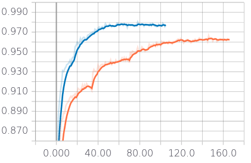

# CS-433 Project 2: Road Segmentation

**This README should allow anyone to replicate our obtained results, for more detailed results,  interpretations, methodology see our report.**

## Introduction

Image Segmentation in a domain of Computer Vision with a wide range of applications, such as medicine, autonomous driving, face recognition and more. In this project we have the goal to classify patches of satellite images obtained from Google Maps into road and background classes. This task is nontrivial as oftentimes the aerial view on roads is obstructed by trees, buildings and cars. Additionally the definition of a road can be very ambiguous in presence of walkways, railroads and other structures.

In this project we compare models based on state of the art image classification research and try to make the most use of the small training set we were given.


Image source: https://www.flickr.com/photos/cwkarl/19022632612/

## Project structure

The project is structured as follows:

```
.
├── dataset                 	# Location of the compressed dataset
│   ├── training         		# Directory containing training data set, with labels
│   └── test_set_images     	# Directory containing the testing data set, no labels
├── src                			# Source code directory
│   ├── run.py	         		# Simple script to reproduce our best results
│   ├── train_pipeline.ipynb	# Pipeline used to train our models
│   ├── helper.py				# Contains general helper functions
│   ├── preprocessing_helper.py	# Contains helper funntions used for preprocessing
│   ├── postprocessing_helper.py# Contains helper funntions used for postprocessing
│   ├── cross_validation.py		# Script to crossvalidate models
│   ├── basic_model.py			# Class with our first basic model
│   ├── dense_model.py			# Class containing a model with large FC layers
│   ├── transfer_learning.py	# Class containing a model performing transfer learning
│   └── deep_model.py			# Class containing our best model
├── template                	# Directory of template files given to us
├── trained_models          	# Directory containing weights of trained models
├── pictures                	# Contains some pictures for this README and the report
├── requirements.txt			# Contains requirements to be installed using pip
├── LICENSE
└── README.md
```

> Important: All files and scripts are designed for Python 3, and require TensorFlow and Keras to be installed in the virtual environment. See more info on how to run the models below.

## Data set

The data set can be downloaded [the EPFL private challenge](https://www.crowdai.org/challenges/epfl-ml-road-segmentation) or from our git repository. The data set is structured as follows: 

- **test set images** 100 images of dimension (400,400,3), i.e. RGB colors, 100 ground truth images
- **training set** 50 images of dimension (400,400,3), no ground truth

## Running our models

The required dependencies can be installed in a virtual environment as follows:

```bash
$ virtualenv venv
$ source activate venv
(venv) $ pip install -r requirements.txt
```

This will install the required **Tensorflow 1.12** and **Keras 2.2.4** amongst others dependencies.

> Note that since we ran our code in an AWS Deep Learning AMI 20.0, the requirements file is somewhat unnecessarily large. 

We have used EC2 instances on AWS, as well as Kaggle Kernels to run our code. If you are interested you will find exact information on how to use these resources in the Appendix at the end of this document.

Finally the provided `run.py` script can either use pre-trained weights (done by default), or by setting `retrain=True`. The `submission.csv` file as will as many other images, with mask, errors etc. will be automatically created.

## Our approach

After experimenting with basic logistic regression and being unhappy with the results obtained, we shifted towards a pure Neural Network approach. To do so we started by creating a basic modular template, that allows to create new models easily, as each model has its own class. 

Our grid search like search for the right hyper-parameters is detailed in the following performance summaries.

### 1. Create deep convolutional neural network architecture

After some research we decided on a "very" deep network inspired by the VGG architecture. In the following we performed many experiments to tune hyper-parameters.

### 2. Data augmentation

#### 2.1 Rotations, Symmetries and random sampling

In parallel we changed our training data to be created by a generator, which samples randomly rotated and mirrored images from anywhere in an image. We noted that performing too many 45 degree rotations did not seem to benefit our model too much.

#### 2.2 Up-sampling minority class

To avoid biases due to less road being represented in the training data, we make sure that the generator returns an equal amount of samples of each class in each batch. The benefit of adding this is depicted below:



Figure 1: x-axis accuracy, y-axis epochs, no up-sampling(orange) versus up-sampling (blue)

### 3. Considering a larger field of view to classify patches

Instead of classifying a 16 x 16 patch by itself, we consider using larger window sizes. To allow this the images has to be padded with pixel, where we chose to mirror pixels, which allows for example to make roads be continuous, even in the padded areas. The best size of images was analyzed as follows:

| Model Description                                            | Training Accuracy | crowdAI F1 |
| ------------------------------------------------------------ | ----------------- | ---------- |
| 64 window Basic Model, no dense, 0.2 dropout, full rotations | 0.950             | -          |
| 80 window Basic Model, no dense, 0.2 dropout, full rotations | 0.955             | 0.843      |
| 100 window Basic Model, no dense, 0.2 dropout, full rotations | 0.963             | 0.870      |
| 120 window Basic Model, no dense, 0.2 dropout, full rotations | 0.949             | 0.826      |

After performing the steps below we came back to this question and retested the effect of window size on our current best model with the following results:

| id   | Model Description   | Training Accuracy | Validation Accuracy | crowd AI F1 | comments |
| ---- | ------------------- | ----------------- | ------------------- | ----------- | -------- |
| 1    | Windows size of 80  | 0.974             | 0.935               | 0.88        |          |
| 2    | Windows size of 100 | 0.980             | 0.943               | 0.884       |          |
| 3    | Windows size of 120 | 0.977             | 0.940               | 0.883       |          |

### 4. Trying various data augmentation ideas

We preprocessed the training set, and added manually hand annotated images to the data set. However, the performance was just shy of our previous best models, which is why we discarded this idea. We think that our trained model might have been more general, as we included many more interesting examples, however it could not benefit from this on the test set.

### 5. Learning rate and dropout adjustments

By adding a callback that automatically lowers the learning rate once a plateau was reached, we improved our score considerably. Additionally we tested different hyper-parameters for the drop out layers

| id   | Model Description                                            | Training Accuracy | Validation Accuracy | crowdAI F1 | comments    |
| ---- | ------------------------------------------------------------ | ----------------- | ------------------- | ---------- | ----------- |
| 1    | 80 window Basic Model, no dense, 0.1 dropout, 10% rotation   | 0.961             | 0.922               | 0.859      |             |
| 2    | 100 window Basic Model, no dense, 0.1 dropout, 10% rotation  | 0.966             | 0.919               | 0.856      |             |
| 3    | 100 window Basic Model, no dense, 0.25 dropout, 10% rotation, initial learning rate = 0.001 | 0.965             | 0.920               | -          |             |
| 4    | 100 window Basic Model, 1 dense, 0.1 dropout, 10% rotation, initial learning rate = 0.0005 | 0.976             | 0.944               | -          | needs rerun |
| 5    | 100 window Basic Model, 1 dense, 0.25 dropout, basic rotation, initial learning rate = 0.0005 | 0.965             | 0.931               | -          |             |
| 6    | 100 window Basic Model, no dense, 0.1 dropout, basic rotation, 50/50 data, initial learning rate = 0.001 | 0.271             | 0.257               | -          | diverged !  |
| 7    | 100 window Basic Model, no dense, 0.1 dropout, basic rotation, 50/50 data, initial learning rate = 0.0005 | 0.980             | 0.943               | 0.884      | new best.   |

### 6. Max pooling and Dense layers

We also experimented with various changes to our initial model, some experiments being shown below.

Each model was trained with 200 epochs (early stop enables) and 20% validation set.

| id   | Model Description   | Training Accuracy | Validation Accuracy | crowdAI F1 | comments |
| ---- | ------------------- | ----------------- | ------------------- | ---------- | -------- |
| 1    | Current best rerun  | 0.978             | 0.941               | 0.884      |          |
| 2    | 1 max pooling less  | 0.987             | 0.940               | 0.88       |          |
| 3    | 0.25 dropout        | 0.978             | 0.933               | 0.869      |          |
| 4    | 1 dense layer added | 0.978             | 0.942               | 0.881      |          |

### 7. Threshold adaptations

Instead of up-sampling the dataset to avoid over representation and bias skewing, we tested using various threshold when classifying into classes. The results have shown to lower our score slightly and no meaningful difference between thresholds has been observed.

| id   | Model Description                | Training Accuracy | Validation Accuracy | crowdAI F1 | comments |
| ---- | -------------------------------- | ----------------- | ------------------- | ---------- | -------- |
| 1    | threshold = 0.2                  | 0.981             | 0.944               | 0.861      |          |
| 2    | threshold = 0.25                 | 0.975             | 0.941               |            |          |
| 3    | threshold = 0.3                  | 0.976             | 0.941               |            |          |
| 4    | threshold = 0.35                 | 0.981             | 0.941               |            |          |
| 5    | threshold = 0.25 and up-sampling | 0.989             | 0.940               |            |          |

### 8. Activation function

We have shown that the standard value of alpha = 0.01 does not work best for us, which is why we used 0.1 in the following.

| id   | Model Description      | Training Accuracy | Validation Accuracy | crowdAI F1 | comments                                              |
| ---- | ---------------------- | ----------------- | ------------------- | ---------- | ----------------------------------------------------- |
| 1    | Best with alpha = 0    | 0.978             | 0.935               | 0.873      | avec 0 de alpha relu -> = relu                        |
| 2    | Best with alpha = 0.1  | 0.980             | 0.943               | 0.884      | The value of alpha relu we used to get the best score |
| 3    | Best with alpha = 0.01 | 0.979             | 0.9371              | 0.877      | Usually the value used..                              |


## Other approaches

Now that our model was established, we continued by trying various other approaches, to compare performance with our own model. These approaches are briefly explained below.

### Transfer learning

We imported the VGG 16 weights trained on the ImageNet dataset, removed the top layers and added 2 fully connected layers of our own. By freezing the weights of the bottom stack of convolutional layers, we hoped the model would preserve its learned feature extraction and be able to outperform our model. See report for results.

### Using predictions to augment feature space

Finally we tried to devise a multiple input neural network, which would use as input the usual window of pixels around the patch to predict but would have as additional input the prediction for neighboring patches made by our pre-trained  best model. We have coded this in a separate Kaggle kernel that can be found here.

## Team members

- Benno Schneeberger
- Tiago Kieliger
- Yann Vonlanthen

## Further ideas

- [ ] Experiment with other Image classification models such as GoogleNet and ResNet
- [ ] Try to improve transfer learning approach.

# Appendix

### EC2 instance from AWS using Keras and Jupyter Notebooks

1. Sign-up for a AWS Educate account, or even better use the promo from the Github student pack to create a full-fledged AWS account.
2. Go to your AWS workbench and follow [this guide](https://hackernoon.com/keras-with-gpu-on-amazon-ec2-a-step-by-step-instruction-4f90364e49ac) until the end of section 3. Note that you should select "Deep Learning AMI (Ubuntu) Version 19.0 " for example from the list of community AMI's.
3. Follow [this AWS guide](https://docs.aws.amazon.com/dlami/latest/devguide/setup-jupyter.html) to run a Jupyter notebook server and access it from your browser. Note that if you have not configured SSL you should use http to access your notebook.

Here are some other tips that might be useful to you :

- The AMI that we installed come with many virtual environments, once you ssh to the machine you can activate the environment you want as described in the login message. Note that to install packages you can use pip, once you activated your virtualenv.
- You will need to tell your Jupyter Notebook which environment to use, this setting can be changed under the `Kernels` tab.

#### Useful commands

```python
ssh -i "aws_key.pem" ubuntu@ec2-18-204-43-147.compute-1.amazonaws.com

ssh -i "aws_key.pem" -L 8157:127.0.0.1:8888 ubuntu@ec2-18-204-43-147.compute-1.amazonaws.com

http://127.0.0.1:8157 # Not HTTPS !

source activate tensorflow_p36

pip install opencv-python

git clone https://github.com/yannvon/road-segmentation.git

```

#### Running TensorBoard

We use TensorBoard to obtain direct feedback and plots from the progress of the training of the model.

All we have to do is add a callback to the keras fit method, as well as running a TensorBoard server on the instance. The following commands are useful:

```
 ssh -i "aws_key.pem" -L 16006:127.0.0.1:6006 ubuntu@ec2-34-206-1-189.compute-1.amazonaws.com

tensorboard --logdir=/home/ubuntu/road-segmentation/src/logs

http://127.0.0.1:16006
```

### Running run.py for training without interruption

```bash
(tensorflow_p36) $ nohup python run.py > /dev/null 2>&1&
```

### Kaggle Kernels

In the second part of our project we mostly used Kaggle Kernels to run our experiments. This allowed us to take advantage of the computing power of K80 GPU's for free, and lower the running time from couple hours to just under two, which is why we found them very convenient to use.

